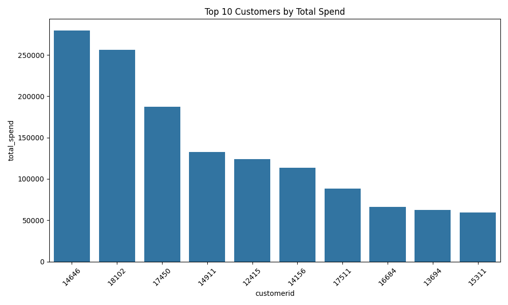

# Customer Segmentation with SQL

This project demonstrates how to perform Customer Segmentation Analysis in SQL on the [UCI e-commerce dataset](https://archive.ics.uci.edu/dataset/352/online+retail). 

## Project Overview
- Demonstrates an **ETL workflow**:
  - **Extract**: Import raw e-commerce transaction data into PostgreSQL
  - **Transform**: Clean and structure the dataset (remove NULL CustomerIDs, create cohorts)
  - **Load**: Store in relational tables for querying and analysis
- Perform **RFM analysis** using SQL  
- Create customer cohorts and segmentation frameworks  
- Use Python for clustering and data visualization  

## Tech Stack
- **PostgreSQL 15** (local install via Homebrew)
- **SQL** (data extraction, transformation, and analysis)
- **Python**: pandas, matplotlib, seaborn for clustering/visuals 

## Setup Instructions

### 1. Clone the repository
```bash
git clone https://github.com/Abimaelh/customer-segmentation-sql.git
cd customer-segmentation-sql
```
### 2. Create Database in PostgreSQL
```sql
CREATE DATABASE ecommerce;
\c ecommerce;
```
### 3. Create Sales Table
```sql
CREATE TABLE sales (
    InvoiceNo VARCHAR(20),
    StockCode VARCHAR(20),
    Description TEXT,
    Quantity INT,
    InvoiceDate TIMESTAMP,
    UnitPrice NUMERIC,
    CustomerID VARCHAR(20),
    Country VARCHAR(50)
);
```

### 4. Import Data
```bash
# Replace with the actual path to your CSV if different
psql -d ecommerce -c "\copy sales FROM '~/datasets/ecommerce/data.csv' CSV HEADER;"
```
## Example SQL Queries
```sql
-- Top 10 spenders
SELECT 
    CustomerID,
    SUM(Quantity * UnitPrice) AS total_spend
FROM sales_clean
GROUP BY CustomerID
ORDER BY total_spend DESC
LIMIT 10;
```


```sql
-- RFM Segmentation
SELECT
    CustomerID,
    DATE_PART('day', CURRENT_DATE - MAX(InvoiceDate)) AS recency,
    COUNT(*) AS frequency,
    SUM(UnitPrice * Quantity) AS total_spend
FROM sales_clean
GROUP BY CustomerID;
```
---
### Next Steps
* 🚧 Python visualizations of the segments *(in-progress)*
* Explore advanced clustering (K-Means, Hierarchical)
* Automate refresh pipelines
---
### Repo Structure
```
customer-segmentation-sql/
│
├── sql/                 # SQL scripts (create, load, queries)
├── scripts/             # Python visualizations
├── reports/             # Insights, charts, documentation
└── README.md            # Project overview
```